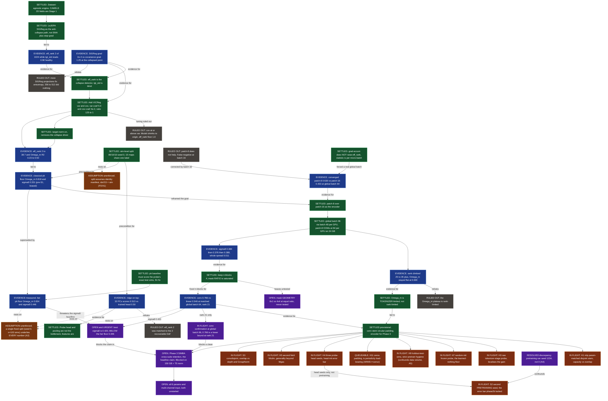

# CONTEXT_GRAPH.md — the central decision graph of vjepa2-engine

**Purpose (scope, strict).** This is the one document that holds **project relationships, structural
architecture, and the reasoning behind decisions — the *what*, the *how*, and the *why*.** Open it
and you should know: how the system is built, what is settled, what each settled thing *rests on*,
what is in flight, and where the record contradicts itself — without re-reading 37 KB of
`learnings.md` and 60 commits.

**What lives where now (this file is the hub):**
- **This file** = decisions + why + what-they-rest-on + structure + relationships (the graph).
- `learnings.md` (L1–L18) = the chronological lab notebook — raw results as they landed. *Primary
  record for numbers.*
- `assumptions.md` = the full independent audit (defects A1–A16, premises P1–P15) at `27b3bda`.
  The decision-relevant parts are migrated into §4 here; that file remains the exhaustive detail.
- `TOOLING.md` = the full Claude-Code tool/skill inventory + workflow rituals. The architecture and
  operating model are migrated into §1 here; that file remains the exhaustive detail.
- `README.md` = the public artifact (currently a phase behind — see §6).

**Sources, in order of authority:** `git log` → `learnings.md` → `README.md` → the `vjepa-study` repo →
`scripts/phase*.sh` headers (which carry the pre-registered read rules for H1/H3/H4/H5/H7/H9/H11/
S1/S2/S3).

**Live state (2026-07-29, this session — supersedes the docs' "nothing running"):** the full audit
pipeline **is executing on a 2×RTX-4090 pod** (`157.157.221.29:31250`): `phase2b_controls.sh`
(linear→conv→mlp + H1/H3/H4/H5/H7) → `phase2b_h9.sh` (H9) → `phase2c_audit.sh` (S3 + S2), chained in
one `auditchain` tmux session. S1 (pk fairness) is **done and measured** (§3 row 17). See §6 for the
per-arm board.

---

## 1. Structural architecture (the *how*)

### 1.1 What the system is
A from-scratch JEPA/LeJEPA engine (`src/`) trained self-supervised on CAMELS 2D cosmology field
maps, evaluated by a **frozen-encoder linear/attentive probe** that regresses two cosmological
parameters (Ω_m, σ8). The scientific question is not "can we predict Ω_m" (a supervised CNN does
that) but **"does masked self-supervision learn features that transfer across simulation suites
better than a 2-point statistic (the power spectrum)."** The headline claim is therefore
**cross-suite retention** (Phase 3), not in-suite accuracy.

### 1.2 Repo layout and dependency direction
```
src/                     the engine — the only code that trains
  jepa_loss.py           ViTEncoder + stems (linear|conv|convdisjoint|mlp), predictor, LeJEPA loss,
                         random_block_mask, EMA target. Stems emit an identical (B, grid², d) token
                         grid so pos-embed/predictor/probe are stem-agnostic.
  sigreg.py              SIGReg anti-collapse term; distributed all-reduce (world=2 ≡ world=1 loss).
  train_fsdp.py          pretraining driver: FSDP + bf16 + activation-checkpointing; builds the
                         ConcatDataset of pooled fields, DistributedSampler, the training loop.
  probe.py               sim_split (THE split, sim-level 80/10/10 seed 0), ProbeHead (attentive
                         pool + MLP), train/eval, load_frozen_encoder (raises on any missing key).
  data/fields.py         Stage-1 CAMELS curation: FieldMapDataset, log10/asinh transform, min_std
                         floor, manifest + disk cache, periodic-symmetry augmentation.
  data/curation.py, infer.py   LEGACY video path — unused by the CAMELS pipeline (see §4 A14).
scripts/                 orchestration + eval (NOT trained code)
  phase*.sh              one orchestrator per phase; each carries the pre-registered read rule in its
                         header and a matched BASE= flag string. phase2b_controls / phase2b_h9 /
                         phase2c_audit are the live battery.
  run_probe.py           single-GPU probe driver (rebuilds encoder at the ckpt's config, --stem must
                         match, precomputes frozen bf16 features, trains the head).
  ps_baseline.py         classical pk / moments / pk+moments ridge baseline (S1: now scores the
                         probe's exact sim_split test set).
  rank_report.py         pooled-vs-token rank diagnostic (⚠ hard-wired patch-16/linear — A10).
  test_*.py              CPU correctness guards for the controls (⚠ live in scripts/, NOT collected
                         by CI — A11).
tests/                   the CI gates (42 tests, CPU-only, depth ≤2 to dodge a CPU-attention segfault).
vjepa-study/             personal research notes, now a separate repo (collapse_resolution.md, day4_results.md).
.github/workflows/ci.yml push/PR gate; re-runs the distributed-SIGReg invariant as its own step.
```
**Dependency rule (verified):** the study code (now the `vjepa-study` repo) depends on `src/`, never
the reverse. No `src/` module imports from `scripts/` or the study code.

### 1.3 Data + training flow (engine stages)
1. **Curate** (`fields.py`): load `Maps_<field>_IllustrisTNG_LH_z=0.00.npy` (1000 sims × 15 maps),
   `log10` transform, `min_std=0.05` floor, cache manifest+stats. Pool 12 fields → `ConcatDataset`.
2. **Pretrain** (`train_fsdp.py`): masked JEPA, LeJEPA SIGReg + VICReg var/cov, `--target-norm`, FSDP
   + bf16 + ckpt, on a `DistributedSampler` over the full pool. Saves `conv_stem.*`/`proj.*` keys.
3. **Probe** (`run_probe.py` + `probe.py`): freeze encoder, `sim_split(seed=0)`, precompute bf16
   features once, train the attentive head 20 epochs, report **test** R² (Ω_m, σ8).
4. **Baseline** (`ps_baseline.py`): pk/moments ridge on the **same** test sims (S1) — the bar to beat.

### 1.4 Operating model (local → pod), and its traps
Work flows **local edit → CPU tests → `git push` main → pod `git pull` → `tmux` launch → `/workspace/logs` → scrape → `learnings.md`/README**. Non-negotiables, each an L-recorded failure:
- **Sync or run stale flags.** Every `phase*.sh` does `cd $WS/vjepa2-engine`; a stale pod checkout
  silently runs the *old* flag set (the most expensive available mistake).
- **Launch detached in `tmux`, never `nohup … &`** over a one-shot SSH (races SIGHUP, dies with no log).
- **`NCCL_P2P_DISABLE=1`** on every no-NVLink pod, or a first-collective deadlock shows as *100% util
  at ~55% TDP* and step 0 never logs. **Power draw, not utilization, is the hang diagnostic.**
- **`PEAK=` must match the card** or logged MFU is fiction: 165 (4090), 153 (RTX 4000 Ada), 77
  (A4000), 312 (A100-class).
- **24 GB cards minimum** for patch-8 batch-48/GPU (~23.7 GB). 16/20 GB cards can't train it.
- **`df -h /workspace` first** — a quota kill truncated a final checkpoint (L15). SIMBA needs +~53 GB.
- **`--workers 32`** on the probe (default 4 starves the GPU during feature precompute; 2.5 h → 45 min).

### 1.5 The control-arm shape (every H*/S* follows this — `4681b87` is the reference)
1. **Pre-registered read rule first**, as a `phase*.sh` header comment (a control without one is post-hoc).
2. **Flag in `src/`** (stem in `jepa_loss.py`; threaded through `train_fsdp.py` argparse **and**
   `run_probe.py` — the probe stem must match the ckpt, nothing enforces it at load).
3. **CPU test that pins the property** the control rests on (geometry or index arithmetic).
4. **A `phase*.sh`** copying the target phase's `BASE=` verbatim + only the new flag (unmatched flag ⇒
   confounded arm).
5. **Ledger update** here (§3) + an `L{n}` in `learnings.md` when it reports.

---

## 2. Decision graph (relationships)

Shapes: green = settled decision · blue = the measurement it rests on · brown dashed = ruled-out ·
orange = hypothesis (now **in flight**, running on the pod this session) · purple = open question.



---

## 3. Decision ledger (what · why · what it forecloses)

| # | Decision | Date / commit | Evidence (the number) | Status | Forecloses |
|---|---|---|---|---|---|
| 1 | ViT-JEPA substrate, not a CNN backbone | `fa1b5f6` | Argument: masked JEPA masks token subsets; "CNN works" refers to *supervised* CAMELS | settled | CNN backbone; the CNN bias must be *imported* (conv stem) |
| 2 | `eff_rank`, not `tgt_std`, is the collapse detector | `69222c1`/`2b7b321` | `tgt_std` ~0.90 steady while `eff_rank` ≈ 2/1024 | settled | "healthy per-dim variance = healthy rep" |
| 3 | Add VICReg var + cov on top of SIGReg | `b521452` | SIGReg ‖∇‖≈2e-4 vs cov ‖∇‖≈1.25 (~6000×) | settled | "tune SIGReg harder"; n_proj 256→512 did nothing |
| 4 | var:cov = 125:1 (`--var-coef 5.0 --cov-coef 4e-2`) | `b521452` | cov≥var → cov 0.006 "perfect" while rank → 1.0 | settled | canonical 25:1; var = SCALE, cov = RANK knob |
| 5 | `--target-norm` on | `b521452` | removes the collapse driver | settled | — |
| 6 | `--sigreg-lambda 0.7 --lr 5e-5` | 2026-07-09/14 | λ=0.02 made collapse cheaper (0.008 vs 0.196) | settled | frozen across every arm; changing it voids cross-phase compares |
| 7 | Sim-level 80/10/10 split, seed 0 | `probe.py:181` | 15 maps share one label; asserts `n_maps%15==0` | settled — **rests on P2/A1** | any map-level split; pooled probe w/o offsetting |
| 8 | Attentive-pool head is not the bottleneck | `3e4cfa0` | ridge/32-PC 0.513 ≈ head 0.50; pooled rank == token rank | settled | "the probe is the ceiling" |
| 9 | Classical baselines are the bar | `d9cb69c` | pk 0.818/0.331; pk+mom 0.823/0.463 | **superseded by S1 (row 17)** | "beat pk on Ω_m"; Ω_m is 2-pt-saturated |
| 10 | Cross-suite **retention** is the headline | `b111172` | design: SIMBA/ITNG R² beats pk's retention | settled (unexecuted) | "beat pk on absolute Ω_m" as the goal |
| 11 | `--grad-accum` can't fix the rank cap | `9dc3490` | per-micro-batch statistic; accum-2 keeps rank ~12 | settled | accumulation as a global-batch substitute |
| 12 | patch-8 over patch-16 | `98aed5a` (L13) | @4000/gb64: p8 0.630/0.367 vs p16 0.433/0.295 | settled | patch-16; reading any A/B at an undertrained batch |
| 13 | Global batch 96 (48/GPU×2), not 128 | `681d26e` (L15) | 64/GPU OOMs 24 GB by ~4 GB; 48/GPU fits ~23.7 GB | settled | "global 128 → rank 72"; 16/20 GB cards for training |
| 14 | Ω_m is **tokenizer-limited, not rank-limited** | `b3e1ec9` (L15) | rank 25→35–38 cleared the 32-dim floor, Ω_m stayed 0.630 | settled | "more batch/rank" as the Ω_m lever |
| 15 | Keep `--n-blocks 4`; mask *ratio* saturated | `1f6dfe5` (L16) | σ8 across 25/50/75%: 0.384→0.376→0.388, spread 0.011 | settled | mask ratio as a σ8 lever (NOT mask geometry) |
| 16 | conv stem, circular padding (`--stem conv`) | `844916c`/`900359b` (L18) | matched gb64: conv **0.766/0.420** vs linear **0.546/0.372** | **provisional** — rank ~21, L18 calls 0.766 a lower bound | causally confirms row 14; sets Phase-3 encoder. Does NOT separate overlap from depth/norm (→ S3) |
| 17 | pk baseline scores the probe's exact test sims (S1) | `15c9d5e` | old = biased **val** R² on a different split. Now `sim_split(seed=0)`, α on val, report **test** | **settled + MEASURED** | every comparison vs 0.818/0.331 |
| — | ↳ fair floor (measured this session) | 2026-07-29 | **pk Ω_m 0.834 / σ8 0.446**; pk+mom 0.837/0.544 (Mgas test) | measured | conv 0.766/0.420 is **below pk on both** in-suite ⇒ transfer is the only headline |
| 18 | Reviewer-control battery — conv landed, gain UNRESOLVED | `36609ad`→`5ca659a` | `conv` @b96 seed0: **Ω_m 0.7968 / σ8 0.4158** (verified). ⚠ compared vs **linear 0.767 seed0**, but our 3-seed linear @b96 = **0.638±0.012 seed1234** — 0.13 apart. convdisjoint/H3-tok/H7/H9/S2 still on `/workspace` (uncommitted) | **PARTIAL — conv number solid, conv-vs-linear GAIN open** | conv-vs-linear delta is undefined until the linear seed conflict is settled; **S2 seed-spread may be the real headline** (delta < seed swing). Do NOT quote a gain yet |
| 19 | Preserve batch 48/GPU for `conv` arms on 32GB+ pod | 2026-07-29 | `conv` OOMs on 24GB RTX 4090 @ batch 48 (~25.5GB needed); retain batch 48 for microbatch alignment | **settled** | microbatch reduction to 32 or grad-accum for `conv` arms |

---

## 4. Load-bearing assumptions (the *why*, and what it all rests on)

These are not decisions — they are premises the results depend on that are **unstated, unenforced, or
unverified**. Migrated from `assumptions.md` §3 (P*) and the correctness findings that threaten a
decision (A*). **This is the most important section for cohesion**: a future decision must not
silently violate one of these.

| # | Premise | Where it bites | Status / risk |
|---|---|---|---|
| **P1** | `Maps_*_LH` store **15 consecutive maps per sim**, so `idx//15` = sim id | every split, baseline, H9 | **UNVERIFIED** — `fields.py:62` itself flags "ordering vs CMD data.py is a VERIFY item". The single largest unexamined premise; checkable offline against CAMELS `data.py` in minutes. |
| **P2 / A1** | curation manifest is the **identity** (`min_std=0.05` drops zero maps), so `idx//15`==`manifest[idx]//15` | `run_probe.py`, `train_fsdp.py` H9 block, `ps_baseline.py` | **Argued in a comment, not asserted.** If any multiple-of-15 maps are ever dropped, `sim_split` partitions the wrong thing and sims leak train↔test — silently. **Fix: assert `len(ds)==len(ds.maps)` (one line each).** True for Mgas today (15000 confirmed). |
| **P3 / A2** | 15 maps of a sim are exchangeable ⇒ test-set map count is harmless | `probe.py:181` | True for bias, **false for variance**: effective test n = **100 sims, not 1500 maps**. Every reported ± is probe-**head**-init noise (±0.03), not split noise. **The single highest-value missing control is `--split-seed` over 3 splits** — above any remaining H*/S*. |
| **A3** | the result scraper reads R² faithfully | `phase2b_controls.sh:65`, `phase2c_audit.sh:59`, `probe_multiseed.sh:34` | **BROKEN, and it threatens the running battery.** Regex `[0-9.]+` can't match a **negative** R² (the H7 random-init floor is the arm most likely to be negative → silently skipped), and `re.search` scans the whole log so a negative in-suite R² makes it match the **SIMBA** line instead. **Fix before the probe battery runs: `(-?[0-9.]+)` + anchor to the IN-SUITE block, or emit a JSON sidecar.** |
| **A4 / D5** | phase scripts train at the seed they print | 5 orchestrators | **RESOLVED as a finding:** `--seed` reaches only the probe head; pretraining ran at `train_fsdp.py` default **1234**, not the "seed 0" echoed. `learnings.md` L16/L18 seed attributions are wrong. S2 uses a genuinely different seed (0) because of this. |
| **A5** | H9 isolates leakage | `phase2b_h9.sh`, `train_fsdp.py:488` | **Confounded:** the holdout arm sees **10% less data** (18k/180k maps) at the same step count. Only the *null* ("heldout ≈ standard ⇒ leakage negligible") is clean; a deficit is equally explained by corpus size. **Fix: drop a matched random 100 sims from the standard arm, or treat H9 as one-sided.** |
| **A6** | probe and baseline use the same protocol | `probe.py:274`, `ps_baseline.py:92` | **Asymmetric:** the pk baseline selects α on val; the probe computes val loss then **discards it** (fixed 20 epochs, no early stop). The headline "SSL vs pk" tunes one side. Fix: select the head by val loss, or state the asymmetry. |
| **A9** | the "strict hygiene" arm never sees the test set | `fields.py:208`, `train_fsdp.py:488` | Standardization mean/std are computed over **all** maps (incl. test) *before* the H9 `Subset`. So even H9 has seen the test set *through the normalization constants*. Negligible numerically (2 scalars over 15k maps) but the claim needs the qualifier. |
| **P5** | bf16 feature cache == the fp32 live path | `run_probe.py:45-64` | Cache stores **bf16** (~3 digits) while `--no-cache` feeds fp32; not numerically identical, no test pins the gap. |
| **P7** | `eff_rank = D/(1+cov_loss)` | `sigreg.py:171` | True **only when the covariance diagonal is unit** (the var hinge enforces it); the relation is conditional, the write-up states it unconditionally. |
| **P9** | distributed SIGReg "≡ single-device in loss *and* gradient" | `sigreg.py:235`, README | **Loss** matches exactly; **gradient** matches up to ×`world`, which DDP/FSDP averaging cancels. The test states this correctly; the README prose is looser. |
| **P11** | pk of the log10 field = "the 2-point information ceiling" | `ps_baseline.py:135` | Honest in the docstring ("what's extractable from the encoder's input", not cosmological P(k)); the README's shorter phrasing drops the qualifier. |
| **P12** | the conv gain is the tokenizer, not capacity/periodicity/nonlinearity | H1/H3/H11/S3 | **This is exactly what the running battery decides.** L18's "band-limiting CONFIRMED" rests on a single 2-arm A/B at one seed with no control run — do not over-state until H1/H3/S3 report. |
| **P13** | Stage-4 inference numbers describe the production encoder | `bench_infer.py:36` | Measured at patch-16/256 tokens; production is patch-8/1024 tokens (~16× attention cost). The 3.8×/4.7×/22% figures are stale for the current config. |

Lower-severity code risks (full detail in `assumptions.md`): **A7** three R² definitions
(`rank_report.py` uses the *train* mean); **A8** throughput/MFU ignore `--grad-accum`; **A10**
`rank_report.py` hard-wired to patch-16/linear, can't load any current ckpt; **A11** the four
`scripts/test_*.py` guards + the `convdisjoint`/`mlp` stems are **not in CI**; **A13** `weights_only=
False` on a CLI path; **A14** dead `curation.py` with a module-level `decord` import + unbounded
recursion; **A15** one mask shared per batch.

---

## 5. Invariants a fresh session must know (not discoverable from the code)

1. **Loss going UP means healthier** — collapsed run scored 0.008, healthy ~1.2 (≈92% cranked
   var/cov). Never compare loss across configs.
2. **`eff_rank`, not `tgt_std`, is the detector.** `tgt_std` 0.90 with rank 2/1024 is collapsed.
3. **`var_coef` = SCALE knob, `cov_coef` = RANK knob, var must dominate ~125:1.** cov≥var shrinks to origin.
4. **The split must be sim-level** (`probe.py:181` is the single source of truth; `ps_baseline.py`
   now imports it). **Rests on P1/P2 — verify them.**
5. **Probe R² varies ±0.03 from head seed alone.** Any smaller delta is noise. All published ± so
   far are **head-init**, not split or pretraining error bars.
6. **`--seed` in the shell scripts reaches the probe, not the trainer** — pretraining ran at 1234 (D5).
7. **`eff_rank ≤ samples in the batch statistic`; `--grad-accum` doesn't help.** ~32-dim intrinsic ⇒
   global batch ≥ ~96 ⇒ 48/GPU ⇒ **24 GB cards minimum**.
8. **The 2-GPU hang looks like healthy util.** 100% util at ~55% TDP = NCCL deadlock; **power draw is
   the tell**; `NCCL_P2P_DISABLE=1` always.
9. **Probe `--stem` must match the ckpt** (nothing enforces it; a mismatch loads silently → garbage R²).
10. **`--workers 32` on the probe** (default 4 starves the GPU; 2.5 h → 45 min).
11. **Check `/workspace` quota before a checkpoint ladder** (a kill truncated a final ckpt; SIMBA +53 GB).
12. **CPU gates cap depth ≤2** (CPU-attention segfaults at 24 layers); the gloo world=2 test **skips on
    Windows** (green local ≠ green CI); the `scripts/test_*.py` guards are **not run by CI** (A11).

---

## 6. Live state, open questions, and known drift

### In flight → split across two pods (2026-07-29; supersedes the single-`auditchain` plan)
`conv` OOMs at batch 48 on the 24 GB 4090 (row 19), so the battery was **split**: linear/mlp
trained+probed on the 24 GB pod (now **stopped** — done); conv + convdisjoint + conv_h9 + *_s0 run on
a **32 GB pod** (a second/antigravity agent) at matched batch 48, coordinating through the shared
RunPod **network volume** `/workspace` (a filesystem *blackboard*: `HANDOFF_CONV.md`,
`RESULTS_LINMLP.md`, `CONV_FIX.md`; not A2A). Final table via `scripts/phase2_verdict.py`.

| ID | Claim | Arm status (2026-07-29) — measured / pending |
|---|---|---|
| — | linear @b96 (rank ~35) | **DONE**: Ω_m **0.638 ± 0.012**, σ8 0.401 (3 seeds). Rose from 0.546 @b64 ⇒ part of L18's +0.22 was rank |
| — | conv @b96 confirmation (row 16, O_B96) | **MEASURED (seed 0)**: Ω_m **0.7968**, σ8 **0.4158**. ⚠ antigravity's "+0.030 vs linear 0.767" uses a **seed-0 linear**; our 3-seed linear = **0.638±0.012 (seed 1234)** — a 0.13 gap. Gain UNRESOLVED; reconcile at matched seed (S2) before quoting any conv-vs-linear delta |
| H1 | mlp param-matched ⇒ capacity vs overlap | **DONE**: mlp Ω_m **0.723 ± 0.002** ≫ linear 0.638 (+0.085) — disjoint, so **capacity/nonlinearity is a real lever w/o overlap**. conv+S3 to settle |
| H3 | raw tokenizer-stage localises the gain | **DONE (surprise)**: linear-tok **0.878**, mlp-tok **0.904** ≫ their encoders (0.638/0.723) & > pk floor ⇒ **the transformer DEGRADES in-suite signal**. conv-tok pending |
| H4 | 3 head-seeds = head-init error bar | **DONE** for linear/mlp (±0.002–0.012) |
| H5 | second field Mcdm = generality | **DONE**: linear 0.606/0.653, mlp 0.675/0.748; mlp>linear holds, Mcdm σ8 ≫ Mgas σ8 |
| H7 | random-init = learned-nothing floor | PENDING on 32 GB pod (`conv` random floor) |
| H9 | holdout-test-sims = no leakage | PENDING on 32 GB pod (`conv_h9`) — ⚠ confounds 10% less data (A5) |
| H11 | zeros vs circular = periodicity | not queued (one `ARMS+=convz` flag) |
| S1 | pk on the probe's test sims | **DONE + measured**: Ω_m **0.834**, σ8 **0.446** (pk+moments 0.837/0.544) |
| S2 | second **pretraining** seed | PENDING on 32 GB pod (`linear_s0`, `conv_s0` vs seed-1234) |
| S3 | convdisjoint = overlap vs depth/norm | **PENDING (the decider)** on 32 GB pod |

### Open questions, exactly
- **Is the σ8 win real?** No, in-suite: best σ8 0.420 < fair floor 0.446 (O_SIGMA8). The non-Gaussian/σ8 claim must come from cross-suite transfer.
- **Overlap, or capacity/nonlinearity?** **Leaning capacity:** mlp (disjoint, +0.085 over linear) already recovers most of the gain (H1). `convdisjoint` (S3) is the decider — pending.
- **Is 0.766 the conv number or a floor?** Pending conv @b96; linear rose to 0.638 @b96, so the real delta = conv@b96 − 0.638, not the old +0.22.
- **Is the transformer even helping in-suite?** **H3 says no** — raw tokenizer (0.878/0.904) beats the encoder. Strongest evidence yet that the whole thesis rests on *transfer*, not in-suite accuracy.
- **Survives a second pretraining seed?** S2 — pending.
- **Mask geometry (8×1 vs 4×4)?** Never run (O_GEOM).
- **Exit gate** (`learnings.md:343`): σ8 ≥ 0.33 **and** Ω_m ≥ ~0.65 before transfer. Conv clears Ω_m; σ8 depends on the floor.
- **All 6 params / multi-channel input** — unstarted.

### Known drift to reconcile (from `assumptions.md` §5 — do NOT auto-resolve; a discrepancy is
usually a stale doc, occasionally a real unrecorded run)
- **D1 (most consequential):** README "σ8 clears the floor (0.388 vs 0.331)" is **inverted** by the fair
  floor 0.446. Best σ8 (0.420) is below it.
- **D2:** two pk floors live at once — 0.818/0.331 appears ~20× repo-wide; 0.834/0.446 appears once.
- **D3:** README is a full phase behind (marks Phase 2 "in progress"; it completed at `900359b`).
- **D4:** README "current best 0.60/0.388" is the Phase-1 m12 arm, not the best (conv 0.766/0.420).
- **D5:** every "seed 0" pretraining claim is actually seed 1234 (A4).
- **D6:** the `eff_rank ≈ 0.55×global_batch` rule is contradicted by every patch-8 observation (~0.33–0.39).
- **D7:** encoder param count quoted as 210M / 202M / ~300M.
- **D10:** "41 tests" → 42 collected; `learnings.md` prints L13 before L12.

### Next (intended order)
1. Finish the running battery → **record every result in `learnings.md`** (L19+) and reconcile D1–D4
   into README + all script echo lines (the pk floor literal alone is ~20 places).
2. **Pre-flight fixes that gate result validity** (do before trusting the battery): A3 scraper, A1/P2
   manifest assert, A5 H9 data-match, then A2 `--split-seed` over 3 splits.
3. Phase 3 SIMBA cross-suite retention — blocked on `/workspace` ≥150 GB and T5 (external mean/std
   injection into `FieldMapDataset` so transfer is zero-shot, not silently re-normalized).
